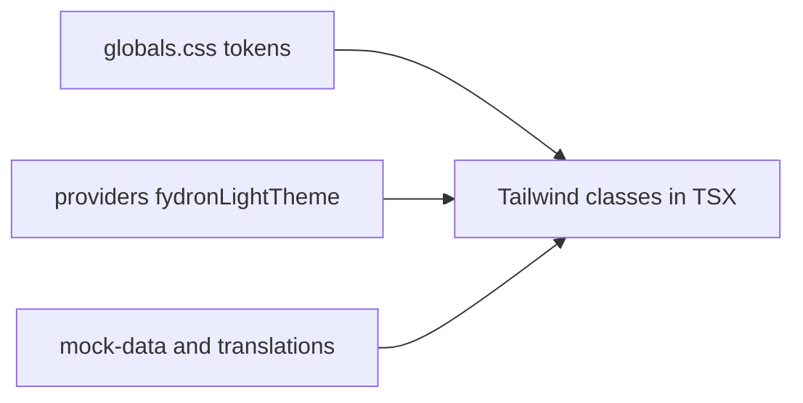

# CSS / visual fine-tuning guide

This document is for **designers and developers** who mainly adjust **colors, typography, spacing, and layout** so the demo matches Figma **without** breaking routing, the demo session, or role-based navigation.

The main developer README is [README.md](./README.md).

---

## How styling flows into the UI

- **Tailwind tokens** (e.g. `bg-surface`, `text-muted`) resolve from CSS variables defined in [`src/app/globals.css`](src/app/globals.css).
- **Fluent controls** (primary buttons, links, focus) use the theme object in [`src/components/providers.tsx`](src/components/providers.tsx).
- **Visible labels** often come from [`src/i18n/translations.ts`](src/i18n/translations.ts) or strings inside [`mock-data.ts`](src/features/dashboard/mock-data.ts) files—not from CSS.

---

## Styling entry points

### Global

| File | What to edit |
|------|----------------|
| [`src/app/globals.css`](src/app/globals.css) | **`:root`** — palette and semantic colors (`--palette-*`, `--background`, etc.). **`@theme inline`** — maps those variables to Tailwind theme keys (`--color-surface`, …). **`body`** — base background, text color, font stack. |

There is **no** large set of per-component `.css` files. Almost all layout and color on screens is **Tailwind utility classes in `.tsx`**.

### Fluent (components from Microsoft)

| File | What to edit |
|------|----------------|
| [`src/components/providers.tsx`](src/components/providers.tsx) | **`fydronLightTheme`** — spread of `webLightTheme` with Fydron brand token overrides (`colorBrandBackground`, link colors, etc.). |

### Per-screen / per-component

Edit **class names** on elements in:

- Feature screens: `src/features/*/*-screen.tsx`
- Feature components: `src/features/*/components/*.tsx`
- Shared shell: [`src/components/app-content-shell.tsx`](src/components/app-content-shell.tsx), [`src/components/right-drawer-frame.tsx`](src/components/right-drawer-frame.tsx), etc.

**Prefer** Tailwind classes that use **design tokens** (`border-border-soft`, `bg-sidebar`, `text-body`) over raw hex in JSX, so changes stay consistent when you tune `globals.css`.

---

## Theme / token map (Figma alignment)

| Goal | Where to change |
|------|------------------|
| **App-wide palette** (backgrounds, borders, muted text, danger/success) | [`globals.css`](src/app/globals.css) `:root` and matching entries under `@theme inline`. |
| **Primary / brand** for Fluent buttons, links, compound controls | [`providers.tsx`](src/components/providers.tsx) `fydronLightTheme` **and** `--palette-primary` in `globals.css` if Tailwind screens should match. |
| **Fonts** | [`src/app/layout.tsx`](src/app/layout.tsx) (`next/font` → CSS variables) **and** `body { font-family: … }` in [`globals.css`](src/app/globals.css). |
| **Spacing, radii, one-off sizes** | Mostly **per-component Tailwind** (`px-4`, `rounded-md`, …). For global rhythm, you can extend `@theme` in Tailwind v4 in `globals.css` instead of scattering magic numbers. |

---

## Mock data and labels (replace “placeholder” content)

Use these files when you need **real document names, roles, or client names** from tickets while keeping the app stable.

| Content | File |
|---------|------|
| Dashboard dossier rows, notifications, sidebar demo | [`src/features/dashboard/mock-data.ts`](src/features/dashboard/mock-data.ts) |
| Matrix portfolio / dossier | [`src/features/matrix/mock-data.ts`](src/features/matrix/mock-data.ts) |
| Clients, dossiers, turbo rows | [`src/features/client-portfolio/mock-data.ts`](src/features/client-portfolio/mock-data.ts) |
| Evidence filenames in auditor turbo | [`src/features/client-portfolio/turbo-dossier-constants.ts`](src/features/client-portfolio/turbo-dossier-constants.ts) |
| Billing table | [`src/features/billing/mock-data.ts`](src/features/billing/mock-data.ts) |
| Partner orgs | [`src/features/partner-assets/mock-data.ts`](src/features/partner-assets/mock-data.ts) |
| Static UI strings (headings, buttons, empty states) | [`src/i18n/translations.ts`](src/i18n/translations.ts) |
| Demo PDF/DOCX mapping by evidence id | [`src/lib/sample-documents.ts`](src/lib/sample-documents.ts) |

**Tip:** Updating **labels** in mock data or translations is usually safe. Changing **`id` fields** or **row order** can break links or role-based navigation unless you also update [`src/lib/dossier-demo-hrefs.ts`](src/lib/dossier-demo-hrefs.ts) and any code that keys off specific ids.

---

## Layout vs navigation / logic (what is safe to touch)

### Low risk (visual and layout)

- Tailwind **classes** on presentational `div` / `span` / `section` wrappers.
- **Spacing, borders, typography, colors** on feature screens and components under `src/features/*/components/`.
- **[`app-content-shell.tsx`](src/components/app-content-shell.tsx)** and similar wrappers—markup and classes, as long as you do not remove **`children`** or break **`flex` / `min-h-0`** chains used for scroll areas (see document preview components if you adjust preview panes).

### High risk (do not change for a “CSS-only” pass)

| Area | Why |
|------|-----|
| **`src/app/**/page.tsx`** | Route entry points; changing default exports or imports breaks Next.js routing. |
| **[`demo-session-gate.tsx`](src/components/demo-session-gate.tsx)** | Enforces login; easy to create redirect loops or flash wrong content. |
| **[`demo-session-context.tsx`](src/features/auth/demo-session-context.tsx)** and **[`demo-accounts.ts`](src/features/auth/demo-accounts.ts)** | Session shape and valid logins. |
| **`useRouter` / `router.push` / `Link href=`** | Navigation targets; “visual” tweaks should not change URLs. |
| **[`dossier-demo-hrefs.ts`](src/lib/dossier-demo-hrefs.ts)** | Maps **Auditor** vs other roles to different client/dossier URLs. |

### Medium risk (tables and role demos)

- **[`dossiers-table.tsx`](src/features/dashboard/components/dossiers-table.tsx)** and **[`matrix-portfolio-table.tsx`](src/features/matrix/components/matrix-portfolio-table.tsx)** — row **roles** and **ids** tie into demo navigation. Safe: chip colors, padding, font size. Risky: renaming roles, reordering rows, or changing ids without updating href helpers and mock data.

**Rule of thumb:** If a change would require updating **TypeScript types** or **route strings**, treat it as **logic**, not fine-tuning—pair with a developer and test all role flows.

---

## DOCX / PDF preview panes

Scrollable document areas use **flex + `min-h-0` + `overflow-hidden` / `overflow-y-auto`** patterns. If a preview stops scrolling after layout tweaks, restore **`min-h-0`** on flex parents and the scroll child (see [`inline-sample-document-preview.tsx`](src/components/inline-sample-document-preview.tsx) and [`document-preview-modal.tsx`](src/components/document-preview-modal.tsx)).
